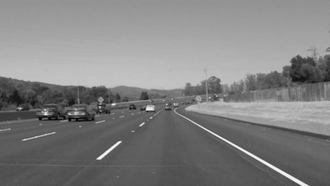
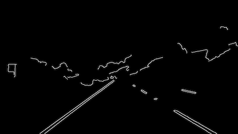
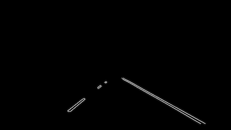
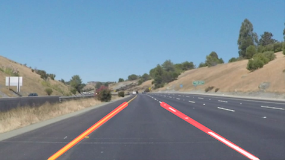

# Finding Lane on the Road 

This project is an introduction to apply image processing techinques such as masking, Canny edge detection and Hough transform to detect lanes in an image and extend them to video.

In an autonomous vehicle a front mounted camera is in a fixed postion, generating a front view of the roads and object. Lanes are of different types, width and quality. Identifying lanes with high confidence is a must for an self driving car or a truck. Hence a roboust logic is required to ensure the intended path of travel is correctly identified.

### Pipeline Development

The pipeline development consists of the following steps.

- Understand the given image or a video file.
- Gray Scale the given image.
- Applying Gaussian filter to reduce noise.
- Use Canny Edge detection to identify the edges.
- Identify the region of interest and mask other regions
- Use Hough transform to identify the lines.
- Perform average function to determine the co-ordinates of the lanes
- Extrapolate the co-orindates to draw the lane

The images recorded by the camera are of dimensions 960 x 540. The images are imported as an array of RGB colourspace. The images are converted to grayscale images. This helps in better idenfitication of lanes, since the Canny edge detection works by identifying the gradient change in the pixels




In order for canny edge detect to identify the changes in gradient the edges of the lanes have to be smooth. This can be achieved by applying Gaussian filter. The kernel setting can be tuned and I found the value of 15 to be optimal.


Canny Edge detection helps in identifying the image edges defined and tuned by the threshold parameters. 
One can play around with threshold parameters. General advice is to use a ratio of 1:3 for the low to high threhold. I found the values of 50 and 150 seems to work very well for this image and video usecase.




The canny edge detected image contains other edges that had to be removed. The region of interest could be applied over the image. The region of interest could be a polygon that cover just right area to capture the potential lane areas.




Using Hough transform on the edge detected images, all the potetial vertices of the lines can be calculated. In order to get better detection, tunning of parameters is essential. The following parameters are the final set that produced a reasonable output both for the images and videos.

```python
# Distance resolution
rho = 1
# Angular resolution
theta = np.pi / 180
# minimum number of vores (Intersection in Hough grid Cell)
threshold = 20
# minimum number of pixels making up a line
min_lin_length = 20
# maximum gap in pixels between connectable line segments
max_line_gap = 300
```

The output of hough transform is an array of line vertices. In order to draw a continous single lane, the array of lines has to be processed to classify in to lines that belong to left lane and right lanes. By calculating the slope and intercept of the line the classification of lines can be accomplished.

By applying different weights for different lengths of the line an average slope and intercept for the left and right lane is calculated.

By using approximate y co-ordinates the vertices of left and right lane are determined. These lines are draw over the original image as detected in lanes.



While processing the video, compensation of the lane moment oscillation and small curvatures are handled by averaging the lanes with previous vertices.

The output video are generated in to the test_video_output

### Potential shortcomings with current pipeline

The following are the shortcomings with the current pipeline

	1. This method will not work better with sharp curvatures, round abouts, exit ramps situations will be difficult to detect.
	3. The images could be masked for yellow or white lines for better edge detection.
	4. This method can only detect straight roads. 
	This pipeline will not work for steep hill road with lower horizon.


### Possible improvements to the pipeline

This method is the fundamental and first approach to lane detection. It could be extended to work for serveral other scenarios.

The following are the possible improvements to the pipeline.

	1. Apply better transform and polyfit line or euler curves to detected curved roads.
	2. Horizon detection for hill road conidtions can improve lane detection.
	3. Identify different types of Lanes.

