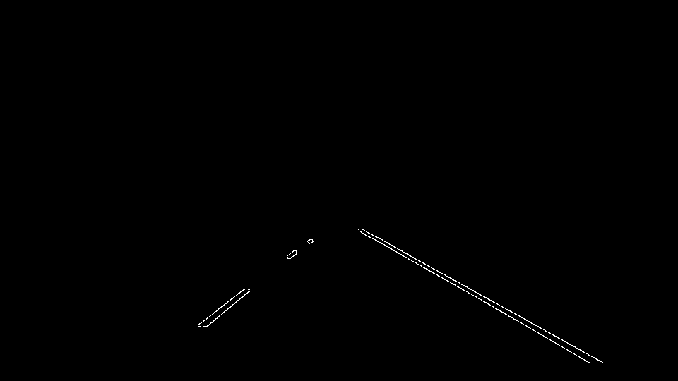

# Finding Lane Lines on the Road 

This project is an introduction to apply image processing techinques such as masking, canny edge detection and hough transform to detect lanes in an image and extend them to video.

In an autonomous vehicle a front mounted camera is in a fixed postion looking generating a front view of the roads and object. Lanes are of different types, width and quality. Identifying lanes with high confidence is a must for an self driving car or a truck. Hence a roboust logic is required to ensure the intended path of travel is correctly identified.

### Pipeline Development

The pipeline development consits of the following steps.

- Understand the given image or a video file.
- Gray Scale the given image.
- Applying Gaussian filter to reduce noise.
- Use Canny Edge detection to identify the edges.
- Identify the region of intrest and mask other regions
- Use Hough transform to idetify the lanes
- Perform average function to determine the co-ordinates of the lanes
- Extrapolate the co-orindates to draw the lane

The images recorded by the camera or dimensions 960 x 540. The images are imported as array of RGB colourspace. The images are converted to grayscale images. This helps in better idenfitication of lanes, since the Canny edge detection works by identifying the gradient change in the pixels


In order for canny edge detect to identify the changes in gradient the edges of the lanes smoother. This can be achieved by applying Gaussian filters. The kernel settting can be tuned and I found the value of 15 to be best.


Canny Edge detection helps in identifying the import edges defined and tuned by the threshold parameters. 
One can play around with threshold parameters. General advice is to use a ratio of 1:3 for the low to high threhold. I found the values of 50 and 150 seems to work very well for this image and video usecase.


The canny edge detected image still contains other edges that had to be removed. The region of intrest could be applied over the image. The region of intrest could be a polygon that cover just right area to capture the potetial lane areas.




Using Hough transform on the edge detected images, all the potetial vertices of the lines can be calculated. In order to get better detection better tunning of parameters is essential. The following parameters are the final set that produced a reasonable output both for the images and videos.

```python
# Distance resolution
rho = 1
# Angular resolution
theta = np.pi / 180
# minimum number of vores (Intersection in Hough grid Cell)
threshold = 20
# minimum number of pixels making up a line
min_lin_length = 20
# maximum gap in pixels between connectable line segments
max_line_gap = 300
```

The output of hough transform is array of line vertices. In order draw a continous single line, the array of lines has to be processed to classify in to lines that belong to left lane and right lanes. By calculating the slope and intercept of the line the classification of lines can be accomplished.

By applying different weights for differnt lengths of the line an average slope and intercept for the left and right lane is calculated.

By using approximate Y co-ordinates the vertices of left and right lane are determined. These lines are draw over the original image as detected in lanes.


While processing video, in order compensate for the shifting lanes and curvature could be compensated by averaging the lanes with previous vertices.

###2. Identify potential shortcomings with your current pipeline


One potential shortcoming would be what would happen when ... 

Another shortcoming could be ...


###3. Suggest possible improvements to your pipeline

A possible improvement would be to ...

Another potential improvement could be to ...
